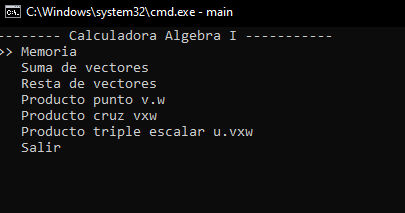

# Resolver Álgebra vectorial
Una calculadora multi usos de álgebra vectorial y demás temas. Los temas que aborda son:
* Álgebra vectorial
* Números complejos
* Funciones polinomiales
* Matrices y determinantes

O al menos las partes de esos temas que veo en primer semestre de ingeniería.
## Como usarla?

Navegas entre las opciones usando `w` (arriba) y `s` (abajo). Seleccionas con `q`.
Después ingresas los datos que te pida. 